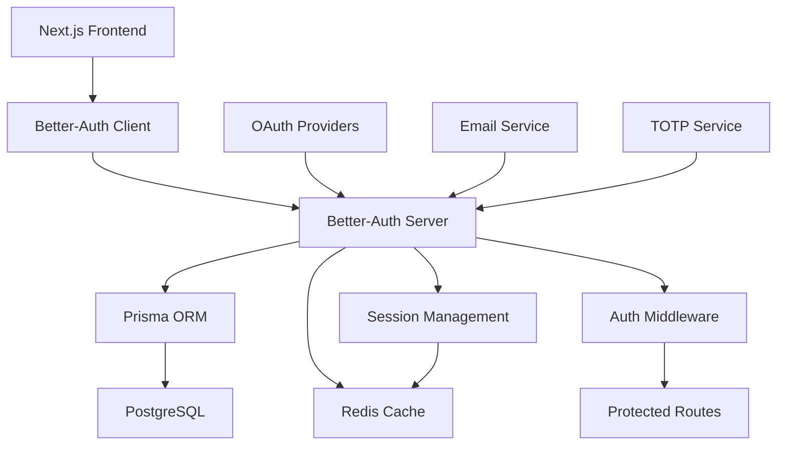

# Design Document

## Overview

L'intégration de better-auth dans KiroCode Mentor suit une approche TypeScript-first qui s'aligne parfaitement avec l'architecture Next.js 15 existante. Better-auth offre une solution d'authentification moderne avec une excellente expérience développeur, une sécurité robuste, et une flexibilité maximale. La conception privilégie la sécurité, la performance, et une intégration seamless avec l'écosystème existant (Prisma, PostgreSQL, Redis).

## Architecture

### Architecture d'Authentification



### Stack Technique d'Authentification

**Better-Auth Core**
- better-auth v1.x (TypeScript-first)
- Intégration native avec Next.js 15 App Router
- Support des Server Components et Client Components
- Middleware d'authentification automatique

**Providers d'Authentification**
- Email/Password avec validation robuste
- OAuth 2.0 : Google, GitHub
- TOTP (Time-based One-Time Password) pour 2FA
- Support extensible pour d'autres providers

**Sécurité**
- JWT avec rotation automatique des tokens
- CSRF protection intégrée
- Rate limiting avec Redis
- Session management sécurisé
- Chiffrement des données sensibles

**Base de Données**
- Extension du schéma Prisma existant
- Tables d'authentification optimisées
- Index de performance pour les requêtes fréquentes
- Migrations automatiques

## Components and Interfaces

### Configuration Better-Auth

```typescript
// lib/auth.ts
import { betterAuth } from "better-auth"
import { prismaAdapter } from "better-auth/adapters/prisma"
import { prisma } from "./prisma"

export const auth = betterAuth({
  database: prismaAdapter(prisma, {
    provider: "postgresql"
  }),
  emailAndPassword: {
    enabled: true,
    requireEmailVerification: true,
    minPasswordLength: 8,
    maxPasswordLength: 128,
  },
  socialProviders: {
    google: {
      clientId: process.env.GOOGLE_CLIENT_ID!,
      clientSecret: process.env.GOOGLE_CLIENT_SECRET!,
    },
    github: {
      clientId: process.env.GITHUB_CLIENT_ID!,
      clientSecret: process.env.GITHUB_CLIENT_SECRET!,
    },
  },
  twoFactor: {
    enabled: true,
    issuer: "KiroCode Mentor",
  },
  session: {
    expiresIn: 60 * 60 * 24 * 7, // 7 days
    updateAge: 60 * 60 * 24, // 1 day
    cookieCache: {
      enabled: true,
      maxAge: 60 * 5, // 5 minutes
    },
  },
  rateLimit: {
    window: 60, // 1 minute
    max: 100, // 100 requests per minute
    storage: "redis",
  },
  plugins: [
    // Custom plugins pour l'intégration KiroCode
  ],
})

export type Session = typeof auth.$Infer.Session
export type User = typeof auth.$Infer.User
```

### Client-Side Integration

```typescript
// lib/auth-client.ts
import { createAuthClient } from "better-auth/react"
import { twoFactorClient } from "better-auth/client/plugins"

export const authClient = createAuthClient({
  baseURL: process.env.NEXT_PUBLIC_APP_URL,
  plugins: [twoFactorClient()],
})

export const {
  signIn,
  signUp,
  signOut,
  useSession,
  getSession,
} = authClient
```

### React Context et Hooks

```typescript
// contexts/auth-context.tsx
'use client'

import { createContext, useContext, useEffect, useState } from 'react'
import { User, Session } from '@/lib/auth'
import { authClient } from '@/lib/auth-client'

interface AuthContextType {
  user: User | null
  session: Session | null
  isLoading: boolean
  signIn: typeof authClient.signIn
  signUp: typeof authClient.signUp
  signOut: typeof authClient.signOut
  updateProfile: (data: Partial<User>) => Promise<void>
}

const AuthContext = createContext<AuthContextType | undefined>(undefined)

export function AuthProvider({ children }: { children: React.ReactNode }) {
  const [user, setUser] = useState<User | null>(null)
  const [session, setSession] = useState<Session | null>(null)
  const [isLoading, setIsLoading] = useState(true)

  useEffect(() => {
    const initAuth = async () => {
      try {
        const sessionData = await authClient.getSession()
        setUser(sessionData.data?.user || null)
        setSession(sessionData.data?.session || null)
      } catch (error) {
        console.error('Auth initialization error:', error)
      } finally {
        setIsLoading(false)
      }
    }

    initAuth()
  }, [])

  const updateProfile = async (data: Partial<User>) => {
    // Implementation pour mise à jour du profil
  }

  return (
    <AuthContext.Provider value={{
      user,
      session,
      isLoading,
      signIn: authClient.signIn,
      signUp: authClient.signUp,
      signOut: authClient.signOut,
      updateProfile,
    }}>
      {children}
    </AuthContext.Provider>
  )
}

export const useAuth = () => {
  const context = useContext(AuthContext)
  if (context === undefined) {
    throw new Error('useAuth must be used within an AuthProvider')
  }
  return context
}
```

### Middleware d'Authentification

```typescript
// middleware.ts
import { NextRequest, NextResponse } from 'next/server'
import { auth } from '@/lib/auth'

export async function middleware(request: NextRequest) {
  const session = await auth.api.getSession({
    headers: request.headers,
  })

  const isAuthPage = request.nextUrl.pathname.startsWith('/auth')
  const isProtectedPage = request.nextUrl.pathname.startsWith('/dashboard') ||
                          request.nextUrl.pathname.startsWith('/profile') ||
                          request.nextUrl.pathname.startsWith('/learning')

  // Redirection si non authentifié sur page protégée
  if (isProtectedPage && !session) {
    return NextResponse.redirect(new URL('/auth/signin', request.url))
  }

  // Redirection si authentifié sur page d'auth
  if (isAuthPage && session) {
    return NextResponse.redirect(new URL('/dashboard', request.url))
  }

  return NextResponse.next()
}

export const config = {
  matcher: [
    '/((?!api|_next/static|_next/image|favicon.ico).*)',
  ],
}
```

### API Routes Integration

```typescript
// app/api/auth/[...all]/route.ts
import { auth } from "@/lib/auth"
import { toNextJsHandler } from "better-auth/next-js"

const handler = toNextJsHandler(auth)

export { handler as GET, handler as POST }
```

## Data Models

### Extension du Schéma Prisma

```prisma
// Ajouts au schema.prisma existant

model User {
  id        String   @id @default(cuid())
  email     String   @unique
  username  String   @unique
  createdAt DateTime @default(now())
  updatedAt DateTime @updatedAt

  // Nouveaux champs d'authentification
  emailVerified    DateTime?
  image            String?
  name             String?
  twoFactorEnabled Boolean   @default(false)

  // Relations existantes
  profile   UserProfile?
  progress  UserProgress[]
  sessions  CollaborativeSession[]

  // Nouvelles relations d'authentification
  accounts         Account[]
  authSessions     Session[]
  twoFactorTokens  TwoFactorToken[]
  passwordResets   PasswordReset[]

  @@map("users")
}

model Account {
  id                String  @id @default(cuid())
  userId            String
  type              String
  provider          String
  providerAccountId String
  refresh_token     String?
  access_token      String?
  expires_at        Int?
  token_type        String?
  scope             String?
  id_token          String?
  session_state     String?
  createdAt         DateTime @default(now())
  updatedAt         DateTime @updatedAt

  user User @relation(fields: [userId], references: [id], onDelete: Cascade)

  @@unique([provider, providerAccountId])
  @@map("accounts")
}

model Session {
  id           String   @id @default(cuid())
  sessionToken String   @unique
  userId       String
  expires      DateTime
  ipAddress    String?
  userAgent    String?
  createdAt    DateTime @default(now())
  updatedAt    DateTime @updatedAt

  user User @relation(fields: [userId], references: [id], onDelete: Cascade)

  @@map("sessions")
}

model VerificationToken {
  id         String   @id @default(cuid())
  identifier String
  token      String   @unique
  expires    DateTime
  createdAt  DateTime @default(now())

  @@unique([identifier, token])
  @@map("verification_tokens")
}

model TwoFactorToken {
  id        String   @id @default(cuid())
  userId    String
  secret    String
  backupCodes String[]
  createdAt DateTime @default(now())
  updatedAt DateTime @updatedAt

  user User @relation(fields: [userId], references: [id], onDelete: Cascade)

  @@unique([userId])
  @@map("two_factor_tokens")
}

model PasswordReset {
  id        String   @id @default(cuid())
  userId    String
  token     String   @unique
  expires   DateTime
  used      Boolean  @default(false)
  createdAt DateTime @default(now())

  user User @relation(fields: [userId], references: [id], onDelete: Cascade)

  @@map("password_resets")
}

model LoginAttempt {
  id        String   @id @default(cuid())
  email     String
  ipAddress String
  success   Boolean
  createdAt DateTime @default(now())

  @@index([email, createdAt])
  @@index([ipAddress, createdAt])
  @@map("login_attempts")
}
```

### Types TypeScript

```typescript
// types/auth.ts
export interface AuthUser extends User {
  profile?: UserProfile
  accounts: Account[]
  sessions: Session[]
}

export interface SignInCredentials {
  email: string
  password: string
  rememberMe?: boolean
}

export interface SignUpCredentials {
  email: string
  password: string
  username: string
  firstName?: string
  lastName?: string
}

export interface PasswordResetRequest {
  email: string
}

export interface PasswordResetConfirm {
  token: string
  password: string
}

export interface TwoFactorSetup {
  secret: string
  qrCode: string
  backupCodes: string[]
}

export interface TwoFactorVerification {
  code: string
  backupCode?: string
}

export interface SessionInfo {
  id: string
  device: string
  location: string
  lastActive: Date
  current: boolean
}
```

## Error Handling

### Gestion d'Erreurs Côté Client

```typescript
// utils/auth-errors.ts
export class AuthError extends Error {
  constructor(
    message: string,
    public code: string,
    public statusCode: number = 400
  ) {
    super(message)
    this.name = 'AuthError'
  }
}

export const handleAuthError = (error: any): string => {
  if (error instanceof AuthError) {
    switch (error.code) {
      case 'INVALID_CREDENTIALS':
        return 'Email ou mot de passe incorrect'
      case 'EMAIL_NOT_VERIFIED':
        return 'Veuillez vérifier votre email avant de vous connecter'
      case 'ACCOUNT_LOCKED':
        return 'Compte temporairement verrouillé. Réessayez dans 15 minutes'
      case 'TWO_FACTOR_REQUIRED':
        return 'Code d\'authentification à deux facteurs requis'
      case 'INVALID_TWO_FACTOR_CODE':
        return 'Code d\'authentification invalide'
      case 'PASSWORD_TOO_WEAK':
        return 'Le mot de passe doit contenir au moins 8 caractères, une majuscule, une minuscule et un chiffre'
      case 'EMAIL_ALREADY_EXISTS':
        return 'Un compte existe déjà avec cette adresse email'
      case 'USERNAME_ALREADY_EXISTS':
        return 'Ce nom d\'utilisateur est déjà pris'
      default:
        return 'Une erreur inattendue s\'est produite'
    }
  }
  
  return 'Erreur de connexion. Veuillez réessayer.'
}
```

### Rate Limiting et Sécurité

```typescript
// lib/rate-limit.ts
import { Redis } from 'ioredis'

const redis = new Redis(process.env.REDIS_URL!)

export class RateLimiter {
  static async checkLimit(
    key: string,
    limit: number,
    window: number
  ): Promise<{ allowed: boolean; remaining: number; resetTime: number }> {
    const current = await redis.incr(key)
    
    if (current === 1) {
      await redis.expire(key, window)
    }
    
    const ttl = await redis.ttl(key)
    const resetTime = Date.now() + (ttl * 1000)
    
    return {
      allowed: current <= limit,
      remaining: Math.max(0, limit - current),
      resetTime,
    }
  }

  static async loginAttempt(email: string, ip: string) {
    const emailKey = `login:email:${email}`
    const ipKey = `login:ip:${ip}`
    
    const [emailLimit, ipLimit] = await Promise.all([
      this.checkLimit(emailKey, 5, 900), // 5 tentatives par email / 15 min
      this.checkLimit(ipKey, 20, 900),   // 20 tentatives par IP / 15 min
    ])
    
    return {
      allowed: emailLimit.allowed && ipLimit.allowed,
      emailRemaining: emailLimit.remaining,
      ipRemaining: ipLimit.remaining,
    }
  }
}
```

## Testing Strategy

### Tests d'Authentification

```typescript
// __tests__/auth/auth.test.ts
import { describe, it, expect, beforeEach } from 'vitest'
import { testClient } from '@/lib/test-utils'

describe('Authentication', () => {
  beforeEach(async () => {
    await testClient.db.user.deleteMany()
  })

  describe('Sign Up', () => {
    it('should create user with valid credentials', async () => {
      const response = await testClient.auth.signUp({
        email: 'test@example.com',
        password: 'SecurePass123',
        username: 'testuser',
      })

      expect(response.success).toBe(true)
      expect(response.data.user.email).toBe('test@example.com')
    })

    it('should reject weak passwords', async () => {
      const response = await testClient.auth.signUp({
        email: 'test@example.com',
        password: '123',
        username: 'testuser',
      })

      expect(response.success).toBe(false)
      expect(response.error.code).toBe('PASSWORD_TOO_WEAK')
    })
  })

  describe('Sign In', () => {
    it('should authenticate with valid credentials', async () => {
      // Setup user
      await testClient.auth.signUp({
        email: 'test@example.com',
        password: 'SecurePass123',
        username: 'testuser',
      })

      const response = await testClient.auth.signIn({
        email: 'test@example.com',
        password: 'SecurePass123',
      })

      expect(response.success).toBe(true)
      expect(response.data.session).toBeDefined()
    })

    it('should implement rate limiting', async () => {
      // Simulate multiple failed attempts
      for (let i = 0; i < 6; i++) {
        await testClient.auth.signIn({
          email: 'test@example.com',
          password: 'wrongpassword',
        })
      }

      const response = await testClient.auth.signIn({
        email: 'test@example.com',
        password: 'SecurePass123',
      })

      expect(response.success).toBe(false)
      expect(response.error.code).toBe('RATE_LIMITED')
    })
  })

  describe('Two-Factor Authentication', () => {
    it('should setup 2FA correctly', async () => {
      const user = await testClient.createUser()
      const session = await testClient.createSession(user)

      const response = await testClient.auth.setupTwoFactor({
        headers: { authorization: `Bearer ${session.token}` }
      })

      expect(response.success).toBe(true)
      expect(response.data.secret).toBeDefined()
      expect(response.data.qrCode).toBeDefined()
      expect(response.data.backupCodes).toHaveLength(10)
    })
  })
})
```

### Tests d'Intégration

```typescript
// __tests__/integration/auth-flow.test.ts
import { describe, it, expect } from 'vitest'
import { render, screen, fireEvent, waitFor } from '@testing-library/react'
import { SignInForm } from '@/components/auth/signin-form'

describe('Authentication Flow', () => {
  it('should complete full sign-in flow', async () => {
    render(<SignInForm />)

    // Fill form
    fireEvent.change(screen.getByLabelText(/email/i), {
      target: { value: 'test@example.com' }
    })
    fireEvent.change(screen.getByLabelText(/password/i), {
      target: { value: 'SecurePass123' }
    })

    // Submit
    fireEvent.click(screen.getByRole('button', { name: /sign in/i }))

    // Wait for redirect
    await waitFor(() => {
      expect(window.location.pathname).toBe('/dashboard')
    })
  })

  it('should handle OAuth flow', async () => {
    render(<SignInForm />)

    fireEvent.click(screen.getByText(/continue with google/i))

    // Mock OAuth redirect
    await waitFor(() => {
      expect(window.location.href).toContain('accounts.google.com')
    })
  })
})
```

## Security Considerations

### Protection CSRF

```typescript
// lib/csrf.ts
import { auth } from './auth'

export const csrfProtection = auth.middleware({
  csrf: {
    enabled: true,
    secret: process.env.CSRF_SECRET!,
    cookieName: '__Host-csrf-token',
    headerName: 'x-csrf-token',
  },
})
```

### Chiffrement des Données

```typescript
// lib/encryption.ts
import crypto from 'crypto'

const algorithm = 'aes-256-gcm'
const secretKey = process.env.ENCRYPTION_KEY!

export class DataEncryption {
  static encrypt(text: string): { encrypted: string; iv: string; tag: string } {
    const iv = crypto.randomBytes(16)
    const cipher = crypto.createCipher(algorithm, secretKey)
    cipher.setAAD(Buffer.from('additional-data'))
    
    let encrypted = cipher.update(text, 'utf8', 'hex')
    encrypted += cipher.final('hex')
    
    const tag = cipher.getAuthTag()
    
    return {
      encrypted,
      iv: iv.toString('hex'),
      tag: tag.toString('hex'),
    }
  }

  static decrypt(encrypted: string, iv: string, tag: string): string {
    const decipher = crypto.createDecipher(algorithm, secretKey)
    decipher.setAAD(Buffer.from('additional-data'))
    decipher.setAuthTag(Buffer.from(tag, 'hex'))
    
    let decrypted = decipher.update(encrypted, 'hex', 'utf8')
    decrypted += decipher.final('utf8')
    
    return decrypted
  }
}
```

### Audit et Logging

```typescript
// lib/audit-log.ts
interface AuditEvent {
  userId?: string
  action: string
  resource: string
  ipAddress: string
  userAgent: string
  metadata?: Record<string, any>
  timestamp: Date
}

export class AuditLogger {
  static async log(event: AuditEvent) {
    await prisma.auditLog.create({
      data: {
        ...event,
        metadata: event.metadata ? JSON.stringify(event.metadata) : null,
      },
    })

    // Log critique vers service externe
    if (event.action.includes('SECURITY_')) {
      await this.sendSecurityAlert(event)
    }
  }

  private static async sendSecurityAlert(event: AuditEvent) {
    // Intégration avec service d'alertes (Slack, email, etc.)
  }
}
```

## Performance Optimizations

### Cache de Session

```typescript
// lib/session-cache.ts
import { Redis } from 'ioredis'

const redis = new Redis(process.env.REDIS_URL!)

export class SessionCache {
  static async get(sessionId: string) {
    const cached = await redis.get(`session:${sessionId}`)
    return cached ? JSON.parse(cached) : null
  }

  static async set(sessionId: string, data: any, ttl: number = 3600) {
    await redis.setex(`session:${sessionId}`, ttl, JSON.stringify(data))
  }

  static async delete(sessionId: string) {
    await redis.del(`session:${sessionId}`)
  }

  static async cleanup() {
    // Nettoyage des sessions expirées
    const expiredSessions = await redis.keys('session:*')
    if (expiredSessions.length > 0) {
      await redis.del(...expiredSessions)
    }
  }
}
```

### Optimisations Base de Données

```sql
-- Index pour les performances d'authentification
CREATE INDEX CONCURRENTLY idx_users_email ON users(email);
CREATE INDEX CONCURRENTLY idx_sessions_token ON sessions(session_token);
CREATE INDEX CONCURRENTLY idx_sessions_user_expires ON sessions(user_id, expires);
CREATE INDEX CONCURRENTLY idx_login_attempts_email_created ON login_attempts(email, created_at);
CREATE INDEX CONCURRENTLY idx_login_attempts_ip_created ON login_attempts(ip_address, created_at);

-- Partitioning pour les logs d'audit (si volume élevé)
CREATE TABLE audit_logs_2024 PARTITION OF audit_logs
FOR VALUES FROM ('2024-01-01') TO ('2025-01-01');
```

## Integration avec KiroCode Mentor

### Synchronisation des Profils

```typescript
// lib/profile-sync.ts
export class ProfileSync {
  static async syncUserProfile(userId: string, authData: any) {
    const existingProfile = await prisma.userProfile.findUnique({
      where: { userId },
    })

    if (!existingProfile) {
      await prisma.userProfile.create({
        data: {
          userId,
          firstName: authData.name?.split(' ')[0],
          lastName: authData.name?.split(' ')[1],
          avatar: authData.image,
        },
      })
    } else {
      await prisma.userProfile.update({
        where: { userId },
        data: {
          avatar: authData.image || existingProfile.avatar,
          updatedAt: new Date(),
        },
      })
    }
  }
}
```

### Hooks d'Authentification

```typescript
// lib/auth-hooks.ts
export const authHooks = {
  afterSignUp: async (user: User) => {
    // Créer le profil utilisateur
    await ProfileSync.syncUserProfile(user.id, user)
    
    // Envoyer email de bienvenue
    await sendWelcomeEmail(user.email)
    
    // Initialiser les données d'apprentissage
    await initializeLearningData(user.id)
  },

  afterSignIn: async (user: User, session: Session) => {
    // Mettre à jour la dernière connexion
    await prisma.user.update({
      where: { id: user.id },
      data: { updatedAt: new Date() },
    })
    
    // Log de sécurité
    await AuditLogger.log({
      userId: user.id,
      action: 'USER_SIGN_IN',
      resource: 'auth',
      ipAddress: session.ipAddress || '',
      userAgent: session.userAgent || '',
      timestamp: new Date(),
    })
  },

  beforeSignOut: async (user: User) => {
    // Sauvegarder l'état de l'apprentissage
    await saveLearningState(user.id)
  },
}
```