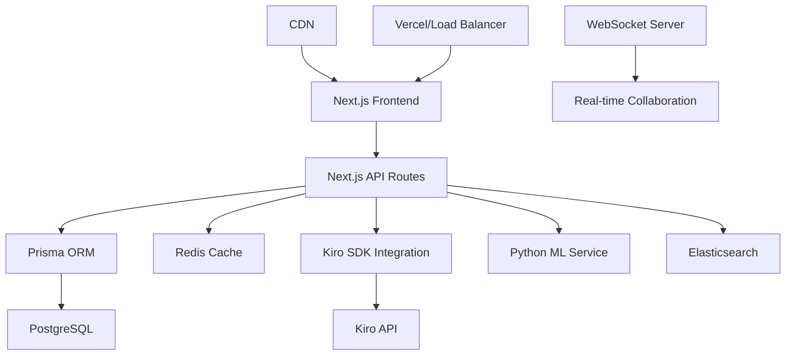

# Design Document

## Overview

KiroCode Mentor est conçue comme une plateforme d'apprentissage adaptative utilisant une architecture microservices moderne. Le système combine l'intelligence artificielle de Kiro avec des technologies web avancées pour créer une expérience d'apprentissage personnalisée et interactive. L'architecture privilégie la scalabilité, la performance et la collaboration temps réel.

## Architecture

### Architecture Globale



### Stack Technique

**Frontend (Next.js 14)**
- Next.js 14 avec App Router et Server Components
- React 18 avec Suspense et Concurrent Features
- TypeScript en mode strict
- TailwindCSS + Framer Motion pour les animations
- Monaco Editor pour l'édition de code
- React Flow pour la visualisation des concepts
- D3.js pour les visualisations de données

**Backend (Next.js Full-Stack)**
- Next.js 14 API Routes avec TypeScript
- Prisma ORM pour la gestion de base de données
- PostgreSQL 15 + Redis pour le cache
- WebSockets (Socket.io) pour la collaboration
- Bull Queue + Redis pour les tâches ML/AI
- Elasticsearch pour la recherche avancée

**IA & Machine Learning**
- Kiro SDK (intelligence principale)
- TensorFlow.js (analyse comportementale côté client)
- Python microservice pour l'analyse de code avancée
- Algorithmes de recommandation personnalisés
- Modèle de détection d'abandon précoce (early dropout prediction)
- Système de gamification adaptatif basé sur la psychologie comportementale
- Analyse de sentiment en temps réel pour détecter la frustration

## Components and Interfaces

### Frontend Components

#### Core Layout Components
```typescript
interface AppLayoutProps {
  children: React.ReactNode;
  user: User;
  navigationState: NavigationState;
}

interface DashboardProps {
  user: User;
  progressData: ProgressData;
  recommendations: Recommendation[];
}
```

#### Code Editor Components
```typescript
interface CodeEditorProps {
  initialCode: string;
  language: string;
  onCodeChange: (code: string) => void;
  onAnalysisRequest: () => void;
  realTimeAnalysis: boolean;
}

interface CodeAnalysisPanel {
  analysis: CodeAnalysis;
  suggestions: Suggestion[];
  errors: CodeError[];
}
```

#### Learning Components
```typescript
interface LearningPathProps {
  pathId: string;
  currentStep: number;
  totalSteps: number;
  adaptiveContent: AdaptiveContent;
}

interface ExerciseComponent {
  exercise: Exercise;
  userProgress: UserProgress;
  onSubmit: (solution: string) => void;
}
```

### Backend Services

#### User Service
```typescript
interface UserService {
  createUser(userData: CreateUserRequest): Promise<User>;
  getUserProfile(userId: string): Promise<UserProfile>;
  updateLearningPreferences(userId: string, preferences: LearningPreferences): Promise<void>;
  trackUserActivity(userId: string, activity: UserActivity): Promise<void>;
}
```

#### Learning Engine
```typescript
interface LearningEngine {
  generateAdaptiveContent(userId: string, topic: string): Promise<AdaptiveContent>;
  analyzeUserProgress(userId: string): Promise<ProgressAnalysis>;
  recommendNextSteps(userId: string): Promise<Recommendation[]>;
  adjustDifficulty(userId: string, currentDifficulty: number): Promise<number>;
}
```

#### Code Analysis Service
```typescript
interface CodeAnalysisService {
  analyzeCode(code: string, language: string): Promise<CodeAnalysis>;
  provideFeedback(code: string, context: LearningContext): Promise<Feedback>;
  detectPatterns(code: string): Promise<CodePattern[]>;
  suggestImprovements(code: string): Promise<Improvement[]>;
}
```

#### Kiro Integration Layer
```typescript
interface KiroIntegration {
  generateExplanation(code: string, userLevel: string): Promise<string>;
  createPersonalizedExercise(userId: string, topic: string): Promise<Exercise>;
  provideMentorship(userId: string, question: string): Promise<MentorResponse>;
  analyzeUserBehavior(userId: string, interactions: Interaction[]): Promise<BehaviorAnalysis>;
  predictUserDropout(userId: string, recentActivity: UserActivity[]): Promise<DropoutRisk>;
  generateMotivationalContent(userId: string, currentMood: UserMood): Promise<MotivationalContent>;
  adaptLearningPath(userId: string, performanceMetrics: PerformanceMetrics): Promise<AdaptedPath>;
}
```

## Data Models

### User Models
```typescript
interface User {
  id: string;
  email: string;
  username: string;
  profile: UserProfile;
  learningPreferences: LearningPreferences;
  createdAt: Date;
  updatedAt: Date;
}

interface UserProfile {
  firstName: string;
  lastName: string;
  avatar?: string;
  bio?: string;
  currentLevel: SkillLevel;
  skillsMatrix: SkillsMatrix;
  achievements: Achievement[];
}

interface LearningPreferences {
  learningStyle: 'visual' | 'auditory' | 'kinesthetic' | 'mixed';
  preferredLanguages: string[];
  difficultyPreference: 'adaptive' | 'challenging' | 'comfortable';
  sessionDuration: number;
  notificationSettings: NotificationSettings;
}
```

### Learning Models
```typescript
interface LearningPath {
  id: string;
  title: string;
  description: string;
  difficulty: SkillLevel;
  estimatedDuration: number;
  prerequisites: string[];
  steps: LearningStep[];
  adaptiveRules: AdaptiveRule[];
}

interface Exercise {
  id: string;
  title: string;
  description: string;
  type: 'coding' | 'quiz' | 'project' | 'debugging';
  difficulty: number;
  expectedSolution?: string;
  testCases: TestCase[];
  hints: Hint[];
}

interface UserProgress {
  userId: string;
  exerciseId: string;
  status: 'not_started' | 'in_progress' | 'completed' | 'mastered';
  attempts: Attempt[];
  timeSpent: number;
  lastAccessed: Date;
  masteryScore: number;
}
```

### Code Analysis Models
```typescript
interface CodeAnalysis {
  id: string;
  code: string;
  language: string;
  errors: CodeError[];
  warnings: CodeWarning[];
  suggestions: CodeSuggestion[];
  complexity: ComplexityMetrics;
  patterns: DetectedPattern[];
  performance: PerformanceAnalysis;
}

interface CodeError {
  line: number;
  column: number;
  message: string;
  severity: 'error' | 'warning' | 'info';
  fixSuggestion?: string;
  explanation: string;
}
```

## Error Handling

### Frontend Error Handling
```typescript
// Error Boundary pour React
class LearningErrorBoundary extends React.Component {
  handleError(error: Error, errorInfo: ErrorInfo) {
    // Log error to monitoring service
    // Show user-friendly error message
    // Provide recovery options
  }
}

// API Error Handling
interface APIError {
  code: string;
  message: string;
  details?: any;
  timestamp: Date;
}

const handleAPIError = (error: APIError) => {
  switch (error.code) {
    case 'ANALYSIS_TIMEOUT':
      return 'L\'analyse du code prend plus de temps que prévu. Veuillez réessayer.';
    case 'KIRO_UNAVAILABLE':
      return 'Le mentor IA est temporairement indisponible. Mode hors ligne activé.';
    default:
      return 'Une erreur inattendue s\'est produite. Notre équipe a été notifiée.';
  }
};
```

### Backend Error Handling
```typescript
// Global Error Handler
interface ErrorHandler {
  handleServiceError(error: ServiceError): Promise<ErrorResponse>;
  logError(error: Error, context: ErrorContext): void;
  notifyAdmins(criticalError: CriticalError): void;
}

// Circuit Breaker Pattern pour Kiro API
class KiroCircuitBreaker {
  private failureCount = 0;
  private lastFailureTime?: Date;
  private state: 'CLOSED' | 'OPEN' | 'HALF_OPEN' = 'CLOSED';
  
  async call<T>(operation: () => Promise<T>): Promise<T> {
    if (this.state === 'OPEN') {
      throw new Error('Circuit breaker is OPEN');
    }
    
    try {
      const result = await operation();
      this.onSuccess();
      return result;
    } catch (error) {
      this.onFailure();
      throw error;
    }
  }
}
```

## Testing Strategy

### Frontend Testing
```typescript
// Component Testing avec React Testing Library
describe('CodeEditor Component', () => {
  test('should provide real-time code analysis', async () => {
    const mockAnalysis = jest.fn();
    render(<CodeEditor onAnalysisRequest={mockAnalysis} realTimeAnalysis={true} />);
    
    const editor = screen.getByRole('textbox');
    fireEvent.change(editor, { target: { value: 'console.log("test")' } });
    
    await waitFor(() => {
      expect(mockAnalysis).toHaveBeenCalled();
    });
  });
});

// Integration Testing
describe('Learning Flow Integration', () => {
  test('should complete full learning exercise flow', async () => {
    // Test complet du parcours d'apprentissage
  });
});
```

### Backend Testing
```typescript
// Unit Testing pour les services
describe('LearningEngine', () => {
  test('should generate adaptive content based on user level', async () => {
    const engine = new LearningEngine();
    const content = await engine.generateAdaptiveContent('user123', 'javascript-basics');
    
    expect(content).toHaveProperty('difficulty');
    expect(content.exercises).toHaveLength.greaterThan(0);
  });
});

// Integration Testing pour les APIs
describe('Code Analysis API', () => {
  test('should analyze code and return feedback', async () => {
    const response = await request(app)
      .post('/api/analyze')
      .send({ code: 'function test() {}', language: 'javascript' })
      .expect(200);
    
    expect(response.body).toHaveProperty('analysis');
    expect(response.body.analysis).toHaveProperty('suggestions');
  });
});
```

### Performance Testing
```typescript
// Load Testing Configuration
const loadTestConfig = {
  scenarios: {
    concurrent_users: {
      executor: 'constant-arrival-rate',
      rate: 100, // 100 utilisateurs par seconde
      timeUnit: '1s',
      duration: '5m',
      preAllocatedVUs: 50,
      maxVUs: 200,
    },
    code_analysis_spike: {
      executor: 'ramping-arrival-rate',
      startRate: 10,
      timeUnit: '1s',
      stages: [
        { duration: '2m', target: 100 },
        { duration: '1m', target: 500 }, // Pic de charge
        { duration: '2m', target: 100 },
      ],
    },
  },
  thresholds: {
    http_req_duration: ['p(95)<200'], // 95% des requêtes < 200ms
    http_req_failed: ['rate<0.01'], // Moins de 1% d'erreurs
  },
};
```

### Security Testing
```typescript
// Security Test Suite
describe('Security Tests', () => {
  test('should prevent code injection in analysis', async () => {
    const maliciousCode = 'eval("malicious code")';
    const response = await request(app)
      .post('/api/analyze')
      .send({ code: maliciousCode, language: 'javascript' });
    
    expect(response.status).toBe(400);
    expect(response.body.error).toContain('potentially dangerous code');
  });
  
  test('should validate user permissions for collaborative sessions', async () => {
    // Test des permissions pour les sessions collaboratives
  });
});
```

## Performance Optimizations

### Frontend Optimizations
- Code splitting par route avec Next.js
- Lazy loading des composants lourds (Monaco Editor)
- Memoization des calculs coûteux avec React.memo
- Virtual scrolling pour les longues listes
- Service Worker pour le cache offline

### Backend Optimizations
- Connection pooling pour PostgreSQL
- Redis clustering pour la scalabilité
- Compression gzip/brotli
- CDN pour les assets statiques
- Database indexing optimisé pour les requêtes fréquentes

### Real-time Optimizations
- WebSocket connection pooling
- Message batching pour réduire la latence
- Conflict resolution algorithms pour la collaboration
- Delta synchronization pour les gros documents

## Advanced Features & Innovations

### Système de Prédiction d'Abandon
```typescript
interface DropoutPredictionSystem {
  analyzeEngagementPatterns(userId: string): Promise<EngagementScore>;
  detectFrustrationSignals(userInteractions: Interaction[]): Promise<FrustrationLevel>;
  triggerInterventions(userId: string, riskLevel: 'low' | 'medium' | 'high'): Promise<void>;
  generateRetentionStrategy(userProfile: UserProfile): Promise<RetentionPlan>;
}
```

### Gamification Adaptative
```typescript
interface AdaptiveGamification {
  personalizeRewards(userId: string, achievementType: string): Promise<PersonalizedReward>;
  adjustChallengeLevel(userId: string, currentPerformance: Performance): Promise<ChallengeLevel>;
  createSocialChallenges(userGroup: User[], skillLevel: SkillLevel): Promise<GroupChallenge>;
  trackMotivationMetrics(userId: string): Promise<MotivationAnalysis>;
}
```

### Système de Mentorat Peer-to-Peer
```typescript
interface PeerMentorshipSystem {
  matchMentorMentee(menteeId: string, criteria: MatchingCriteria): Promise<MentorMatch[]>;
  facilitateKnowledgeSharing(sessionId: string): Promise<KnowledgeSharingSession>;
  trackMentorshipEffectiveness(relationshipId: string): Promise<EffectivenessMetrics>;
  rewardMentors(mentorId: string, contribution: MentorContribution): Promise<void>;
}
```

### Analyse Comportementale Avancée
```typescript
interface BehaviorAnalytics {
  detectLearningPatterns(userId: string, timeframe: TimeRange): Promise<LearningPattern[]>;
  identifyOptimalLearningTimes(userId: string): Promise<OptimalSchedule>;
  analyzeCodeWritingStyle(userId: string, codeHistory: CodeHistory[]): Promise<CodingStyle>;
  predictSkillProgression(userId: string, currentSkills: Skill[]): Promise<ProgressionForecast>;
}
```

### Accessibilité et Inclusion
```typescript
interface AccessibilityFeatures {
  provideDyslexiaSupport(content: string): Promise<DyslexiaFriendlyContent>;
  generateAudioExplanations(textContent: string, userPreferences: AudioPreferences): Promise<AudioContent>;
  adaptForVisualImpairment(interface: UIComponent): Promise<AccessibleUIComponent>;
  supportMultipleLanguages(content: string, targetLanguage: string): Promise<TranslatedContent>;
}
```