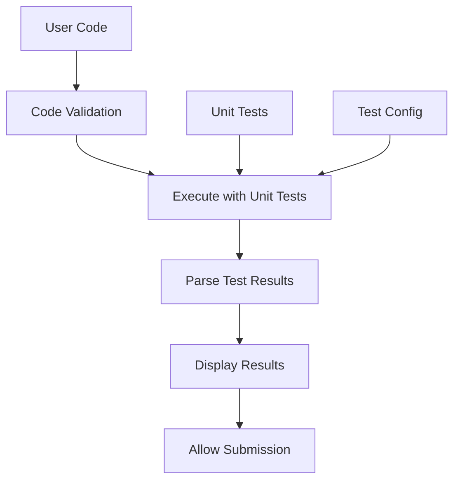

# Intégration des Tests Unitaires

## 🎯 Fonctionnalités Ajoutées

### 1. **Nouveaux Champs Prisma**
```prisma
model Challenge {
  // ... champs existants
  
  // Tests unitaires
  unitTests    String? // Code des tests unitaires
  testFramework TestFramework @default(JEST) // Framework de test utilisé
  testTimeout  Int @default(5000) // Timeout en ms
  testSetup    String? // Code de setup pour les tests
  testTeardown String? // Code de cleanup après les tests

  // Configuration d'exécution
  allowedImports String[] @default([]) // Imports autorisés
  memoryLimit   Int @default(128) // Limite mémoire en MB
  timeLimit     Int @default(10) // Limite temps en secondes
}

enum TestFramework {
  JEST, MOCHA, VITEST, PYTEST, JUNIT, GTEST, CUSTOM
}
```

### 2. **Service d'Exécution de Code**
- **`code-execution.service.ts`** : Service pour exécuter le code avec tests
- **Simulation sécurisée** : Tests simulés en attendant un vrai service
- **Support multi-langages** : JavaScript, TypeScript, Python, Java
- **Validation de sécurité** : Vérification des patterns dangereux

### 3. **Composants d'Interface**

#### `TestResultsPanel`
- **Affichage des résultats** : Tests passés/échoués avec détails
- **Métriques d'exécution** : Temps et mémoire utilisés
- **Interface responsive** : Adapté mobile et desktop
- **Feedback visuel** : Couleurs et icônes pour les résultats

#### `UnitTestEditor`
- **Éditeur de tests** : Monaco Editor pour les tests unitaires
- **Templates** : Templates par framework (Jest, PyTest, JUnit)
- **Mode preview/edit** : Visualisation et édition des tests
- **Support multi-frameworks** : Détection automatique du langage

#### `EnhancedChallengeEditor`
- **Interface unifiée** : Éditeur, tests, et résultats en un
- **Layout responsive** : Onglets sur mobile, panels sur desktop
- **Workflow intégré** : Analyse → Test → Soumission
- **Feedback temps réel** : Notifications et états de chargement

## 🔧 Architecture

### Flux d'Exécution


### Structure des Données
```typescript
interface TestResult {
  passed: boolean;
  testName: string;
  description?: string;
  error?: string;
  executionTime?: number;
  output?: string;
}

interface CodeExecutionResult {
  success: boolean;
  output: string;
  error?: string;
  executionTime: number;
  memoryUsage?: number;
  testResults?: TestResult[];
}
```

## 📱 Interface Responsive

### Mobile (< 1024px)
- **Onglets** : Editor, Tests, Results séparés
- **Navigation tactile** : Swipe entre les onglets
- **Boutons compacts** : Icônes seulement

### Desktop (≥ 1024px)
- **Vue Split** : Éditeur + Résultats côte à côte
- **Panels redimensionnables** : Ajustement de la taille
- **Boutons complets** : Icônes + texte

## 🧪 Frameworks Supportés

### JavaScript/TypeScript
```javascript
// Jest/Vitest
describe('User Code Tests', () => {
  test('should work correctly', () => {
    expect(userFunction()).toBe(expected);
  });
});
```

### Python
```python
# PyTest
def test_basic_functionality():
    assert user_function() == expected
```

### Java
```java
// JUnit
@Test
public void testBasicFunctionality() {
    assertEquals(expected, userMethod());
}
```

## 🔒 Sécurité

### Validation du Code
- **Patterns dangereux** : Détection d'`eval`, `exec`, `system`
- **Imports restreints** : Liste blanche d'imports autorisés
- **Limites d'exécution** : Timeout et mémoire

### Sandboxing (Future)
- **Conteneurs isolés** : Docker pour l'exécution
- **Réseau restreint** : Pas d'accès internet
- **Système de fichiers** : Accès limité

## 📊 Métriques

### Collectées
- **Temps d'exécution** : Performance du code
- **Utilisation mémoire** : Efficacité
- **Taux de réussite** : Tests passés/total
- **Tentatives** : Nombre d'essais

### Affichées
- **Progress bar** : Pourcentage de réussite
- **Badges** : Statut des tests
- **Graphiques** : Métriques d'exécution

## 🚀 Utilisation

### Challenge avec Tests
```tsx
<EnhancedChallengeEditor
  challengeId="challenge-1"
  initialCode="// Your code here"
  language="javascript"
  unitTests="test('should work', () => { expect(true).toBe(true); });"
  testFramework="JEST"
  testConfig={{
    timeout: 5000,
    memoryLimit: 128,
    timeLimit: 10
  }}
  onCodeSubmit={handleSubmit}
/>
```

### Tests Seulement
```tsx
<UnitTestEditor
  unitTests={testCode}
  language="javascript"
  framework="JEST"
  onTestsChange={setTestCode}
  onRunTests={runTests}
/>
```

### Résultats Seulement
```tsx
<TestResultsPanel
  results={executionResults}
  isLoading={isRunning}
/>
```

## 🔄 Migration Appliquée

```sql
-- Migration: 20250815184940_add_unit_tests_to_challenges
ALTER TABLE "challenges" ADD COLUMN "unitTests" TEXT;
ALTER TABLE "challenges" ADD COLUMN "testFramework" "TestFramework" NOT NULL DEFAULT 'JEST';
ALTER TABLE "challenges" ADD COLUMN "testTimeout" INTEGER NOT NULL DEFAULT 5000;
ALTER TABLE "challenges" ADD COLUMN "testSetup" TEXT;
ALTER TABLE "challenges" ADD COLUMN "testTeardown" TEXT;
ALTER TABLE "challenges" ADD COLUMN "allowedImports" TEXT[] DEFAULT ARRAY[]::TEXT[];
ALTER TABLE "challenges" ADD COLUMN "memoryLimit" INTEGER NOT NULL DEFAULT 128;
ALTER TABLE "challenges" ADD COLUMN "timeLimit" INTEGER NOT NULL DEFAULT 10;
```

## ✅ Avantages

1. **Validation automatique** : Tests unitaires pour vérifier la correction
2. **Feedback immédiat** : Résultats en temps réel
3. **Interface intuitive** : Workflow naturel pour les développeurs
4. **Multi-langages** : Support étendu des langages populaires
5. **Responsive** : Fonctionne sur tous les appareils
6. **Sécurisé** : Validation et sandboxing du code
7. **Extensible** : Facile d'ajouter de nouveaux frameworks

L'intégration des tests unitaires transforme la plateforme en un véritable environnement de développement interactif ! 🎉